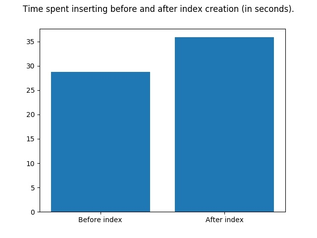
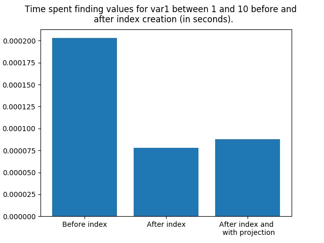

# Rayndex MongoDB
Atividade da disciplina de Banco de Dados NOSQL

### Pre requisitos
1. Python
2. MongoDB

### Informações gerais
A proposta dessa atividade é aplicar o conhecimento adquirido em sala de aula sobre Index no MongoDB, desenvolvendo um pequeno programa que crie e salve documentos em uma coleção tal que:

1. O documento tem que possuir dois campos (**var1 e var2**) numéricos com valores aleatórios de 0 a 100; 

2. Sejam implementados os seguintes itens:

    - **Item 1**: Gere e insira 1.000.000 de documentos na coleção e calcule o tempo gasto nessa operação;
    
    - **Item 2**: Busque por valores de var1 que estejam entre 0 e 10 e calcule o tempo gasto nessa operação;
    
    - **Item 3**: Crie um index para var1, repita a consulta anterior e calcule o tempo gasto nessa operação;
    
    - **Item 4**: Repita a consulta anterior retornando somente o valor de var1, removendo os demais usando projeção, e calcule o tempo gasto nessa operação;
    
    - **Item 5**: Gere e insira mais 1.000.000 de documentos na coleção e calcule o tempo gasto nessa operação.
    
A ideia é comparar os tempos gastos nessas operações, considerando dois cenários: antes e depois da criação do indíce.

### Desenvolvimento da solução
Todos os itens foram desenvolvidos em um arquivo único (*index.py*). Nesse arquivo, existem duas funções principais, a **run** e a **main**. Na run foram desenvolvidos todos os itens citados acima. Já a main chama a run e gera os gráficos com os resultados obtidos. Além disso, todos os arquivos gerados com os tempos de execução ficam armazenados na pasta *files*; já as imagens com os gráficos gerados ficam na pasta *images*.

### Executando o projeto
Para executar o projeto, primeiramente clone esse repositório em sua máquina.

Certifique-se de que o MongoDB esteja executando na porta padrão (27017).

Importe o *pymongo* (`pip3 install pymongo`), *pandas* (`pip3 install pandas`) e *matplotlib* (`pip3 install matplotlib`).

Depois, execute o comando `python3 index.py` e aguarde o fim do processamento. 

Pronto! Os gráficos obtidos a partir da sua execução estarão na página **images**.

### Resultados obtidos
Primeiramente é importante mensionar que o que vai ser mostrado a seguir leva em consideração o meu caso de teste.

Falando do tempo de inserção antes e depois da criação do index, o Gráfico 1 abaixo expressa a diferença obtida:

O que pode ser observado é que após a criação do index, o tempo de inserção aumentou em torno de 7 segundos. Esse comportamento já era esperado, já que uma das desvantagens dessa abordagem é o aumento do tempo gasto para inserção.

Já levando em consideração as consultas na coleção, o Gráfico 2 a seguir apresenta o que tempo obtido nas operações:

O que podemos observar é que o tempo gasto nas consultas depois da criação do índice diminuiu consideravelmente do tempo gasto antes, mesmo aplicando a projeção. Esse comportamento já era esperado, já que a principal vantagem na utilização de índices é, justamente, a rápidez na obtenção dos resultados das buscas.
